<div align="center">
    <h1>
    SVOR (<b>S</b>table <b>V</b>ideo <b>O</b>bject <b>R</b>emoval)
    </h1>
    <p>
    Official PyTorch code for <em>From Ideal to Real: Stable Video Object Removal under Imperfect Conditions</em><br>    </p>
    </p>
    <a href="https://arxiv.org/abs/2603.09283"></a>
    <a href="https://xiaomi-research.github.io/svor" target='_blank'></a>
    <a href='https://huggingface.co/HigherHu/SVOR'></a>
    <a href='https://huggingface.co/datasets/HigherHu/RORD-50'></a>
    <a href="https://www.apache.org/licenses/LICENSE-2.0"></a>


⭐ If SVOR is helpful to your projects, please help star this repo. Thanks! 🤗

</div>


## News

* **`Apr. 21th, 2026`:** [Inference code](#quick-test) and [pretrained loras](#pretrained-weights) are now available. 🎉

* **`Apr. 16th, 2026`:** 🏆 SVOR-based solution has won 1st place at the [Physics-aware Video Instance Removal Challenge](https://xiangbogaobarry.github.io/PVIX-CVPR-VGBE-2026/), CVPR 2026. 🎉

* **`Apr. 10th, 2026`:** The [Video Removal Skill](https://clawhub.ai/wangfei1204/mi-visionforge-svor) is now live on ClawHub! Powered by SVOR (an internally updated version) and [MiMo-V2-Omni](https://mimo.xiaomi.com/mimo-v2-omni), it removes objects from your videos using just a text prompt — **no mask required**. Pro tip: Pair it with [MiMo-V2-Pro](https://mimo.xiaomi.com/mimo-v2-pro) for the ultimate experience! 🎉

* **`Apr. 10th, 2026`:** Github repository and [project page](https://xiaomi-research.github.io/svor) is now available. 🎉

* **`Mar. 10th, 2026`:** We released our paper on [Arxiv](https://arxiv.org/abs/2603.09283).


## Updates

- [x] Release Inference Code and Pretrained Models
- [x] Release Skill, use this SVOR_API_KEY: `sk-mipixgen-test`
- [x] Release Github repository and Project Page
- [x] Release Paper


## Overview

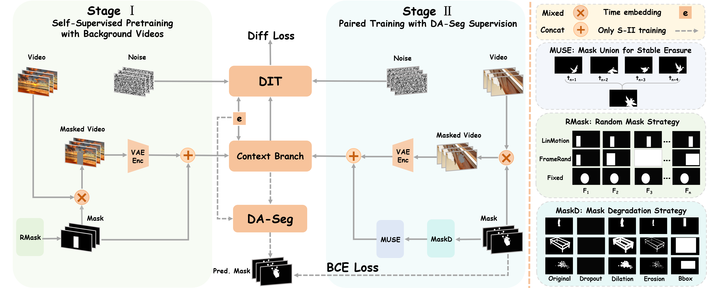

Removing objects from videos remains difficult in the presence of real-world imperfections such as shadows, abrupt motion, and defective masks. Existing diffusion-based video inpainting models often struggle to maintain temporal stability and visual consistency under these challenges. We propose **Stable Video Object Removal (SVOR)**, a robust framework that achieves shadow-free, flicker-free, and mask-defect-tolerant removal through three key designs: (1) **Mask Union for Stable Erasure (MUSE)**, a windowed union strategy applied during temporal mask downsampling to preserve all target regions observed within each window, effectively handling abrupt motion and reducing missed removals; (2) **Denoising-Aware Segmentation (DA-Seg)**, a lightweight segmentation head on a decoupled side branch equipped with {Denoising-Aware AdaLN } and trained with mask degradation to provide an internal diffusion-aware localization prior without affecting content generation; and (3) **Curriculum Two-Stage Training**: where Stage I performs self-supervised pretraining on unpaired real-background videos with online random masks to learn realistic background and temporal priors, and Stage II refines on synthetic pairs using mask degradation and side-effect-weighted losses, jointly removing objects and their associated shadows/reflections while improving cross-domain robustness. Extensive experiments show that SVOR attains new state-of-the-art results across multiple datasets and degraded-mask benchmarks, advancing video object removal from ideal settings toward real-world applications.

## Results

For more visual results, go checkout our <a href="https://xiaomi-research.github.io/svor/" target="_blank">project page</a>

<h3>Common Masks</h3>
<table>
  <thead>
    <tr>
      <th>Masked Input</th>
      <th>Result</th>
    </tr>
  </thead>
  <tbody>
    <tr>
      <td>
        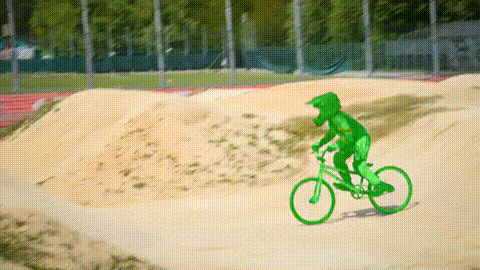
      </td>
	  <td>
        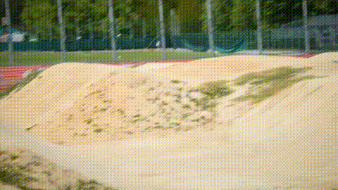
      </td>
    </tr>
    <tr>
      <td>
        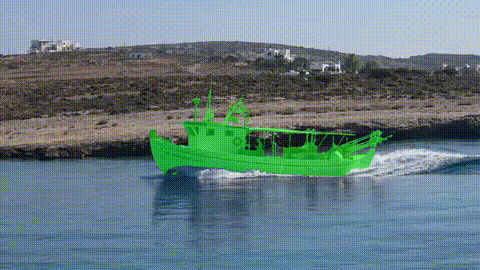
      </td>
      <td>
        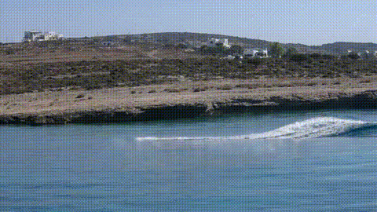
      </td>
    </tr>
    <tr>
      <td>
        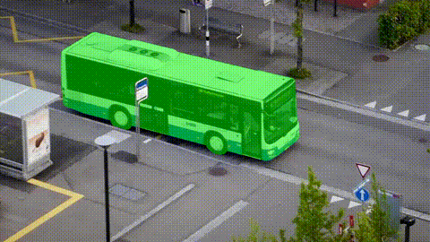
      </td>
      <td>
        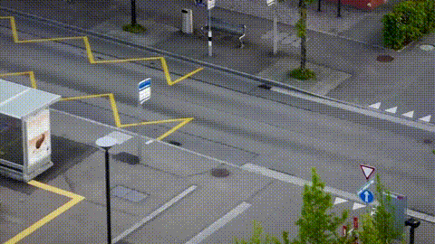
      </td>
    </tr>
    <tr>
      <td>
        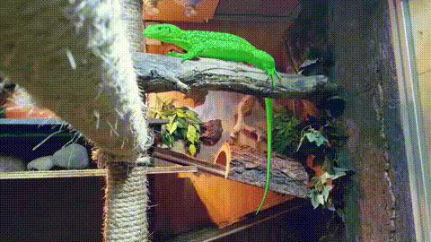
      </td>
      <td>
        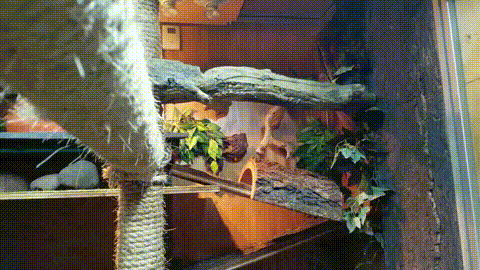
      </td>
    </tr>
    <tr>
  </tbody>
</table>

<h3>Defective Masks</h3>
<table>
  <thead>
    <tr>
      <th>Masked Input</th>
      <th>Result</th>
    </tr>
  </thead>
  <tbody>
    <tr>
      <td>
        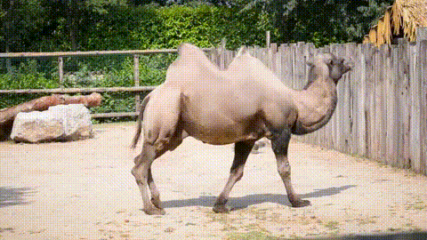
      </td>
	  <td>
        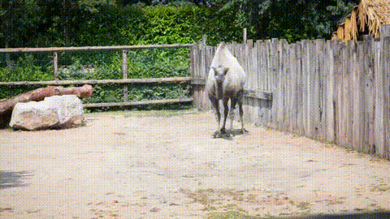
      </td>
    </tr>
    <tr>
      <td>
        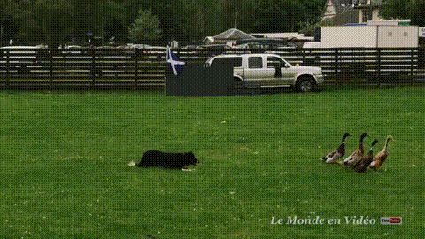
      </td>
      <td>
        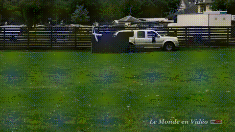
      </td>
    </tr>
    <tr>
      <td>
        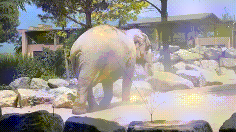
      </td>
      <td>
        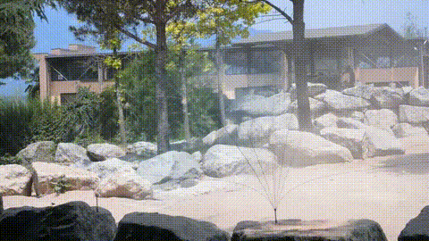
      </td>
    </tr>
    <tr>
      <td>
        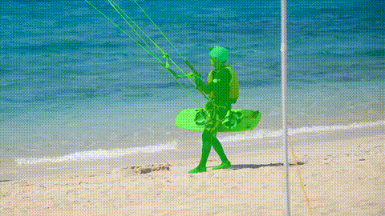
      </td>
      <td>
        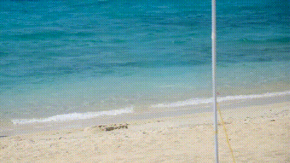
      </td>
    </tr>
    <tr>
  </tbody>
</table>


## Dependencies and Installation

The code is tested with Python 3.10.

1. Clone Repo

   ```bash
   git clone https://github.com/xiaomi-research/SVOR.git
   ```
2. Create Conda Environment and Install Dependencies

   ```bash
   # create new anaconda env
   conda create -n svor python=3.10 -y
   conda activate svor

   # install pytorch
   pip install torch==2.7.0 torchvision==0.22.0 torchaudio==2.7.0

   # install other python dependencies
   pip install -r requirements.txt
   ```
3. [Optional] Install flash-attn, refer to [flash-attention](https://github.com/Dao-AILab/flash-attention)

    ```bash
    pip install packaging ninja psutil
    pip install flash-attn==2.7.4.post1 --no-build-isolation
    ```

### [Optional] Run with docker

```bash
docker build -f Dockerfile.ds -t SVOR:latest .
docker run --gpus all -it --rm -v /path/to/videos:/data -v /path/to/models:/root/models SVOR:latest
```

## Pretrained Weights

Download pretrained weights and put them to `models/`:

- download [Wan-AI/Wan2.1-VACE-1.3B](https://huggingface.co/Wan-AI/Wan2.1-VACE-1.3B)
- download our trained two loras from [HigherHu/SVOR](https://huggingface.co/HigherHu/SVOR)

The files in `models/` are as follows:

```

models/
├── put models here.txt
├── remove_model_stage1.safetensors
├── remove_model_stage2.safetensors
└── Wan2.1-VACE-1.3B/

```

## Quick test

Run the following scripts, and results will be save to `samples/SVOR/`:

```python
python predict_SVOR.py \
  --input_video samples/input/bmx-bumps_raw.mp4 \
  --input_mask_video samples/input/bmx-bumps_mask.mp4
```

```
Usage:

python predict_SVOR.py [options]

Some key options:
  --input_video            Path to input video
  --input_mask_video       Path to mask video
  --num_inference_steps    Inference steps (default: 20)
  --save_dir               Output directory
  --sample_size            Frame size: height,width (default: 720,1280)
```

**ATTENTION**:

1. In default, it will use about **33GB** GPU memory to run the inference.

2. To run the inference on a GPU with 24GB memory (e.g., RTX 3090, RTX 4090), you can set `--gpu_memory_mode` to `model_cpu_offload`.

3. To further reduce the GPU memory usage, you can set `--sample_size` to `480,832` or smaller.

## Interactive Demo

1. Install [SAM2](https://github.com/facebookresearch/sam2) and download pretrained weights [sam2.1_hiera_large.pt](https://dl.fbaipublicfiles.com/segment_anything_2/092824/sam2.1_hiera_large.pt) to `models/`

2. Start the gradio demo

    ```bash
    python -m demo.gradio_app
    ```

    Ensure it print the following informations:
    ```
    ...
    [Info] SAM2 Predictor initialized successfully
    ...
    [Info] Removal model Predictor initialized successfully
    Running on local URL:  http://0.0.0.0:7861

    ```

3. Open the web page: http://[ServerIP]:7861

    ```
    Usage
    1. Upload a video and click "Process video" button in the "1. Upload and Preprocess" tab page
    2. Switch to "2. Annotate and Propagate" tab page, click to segment the objects
    3. "Add annotation" and "Propagate masks", to finish the segmentation
    4. Check the object ID in "Display object list", and switch to "3. Remove Objects" tab page
    5. Click "Preview video" to preview input video and mask video
    6. Click "Start removal" to run the SVOR algorithm
    ```


## RORD-50 Dataset

The RORD-50 Dataset can be downloaded from [HigherHu/RORD-50](https://huggingface.co/datasets/HigherHu/RORD-50)


## Acknowledgement

Our work benefit from the following open-source projects:

- [VideoX-Fun](https://github.com/aigc-apps/VideoX-Fun)
- [VACE](https://github.com/ali-vilab/VACE)
- [ROSE](https://github.com/Kunbyte-AI/ROSE)
- [SAM2 - Segment Anything Model 2](https://github.com/facebookresearch/sam2)
- [RORD](https://github.com/Forty-lock/RORD)

## Citation

If you find our repo useful for your research, please consider citing our paper:

```bibtex
@article{hu2026svor,
   title={From Ideal to Real: Stable Video Object Removal under Imperfect Conditions},
   author={Hu, Jiagao and Chen, Yuxuan and Li, Fuhao and Wang, Zepeng and Wang, Fei and Zhou, Daiguo and Luan, Jian},
   journal={arXiv preprint arXiv:2603.09283},
   year={2026}
}
```
